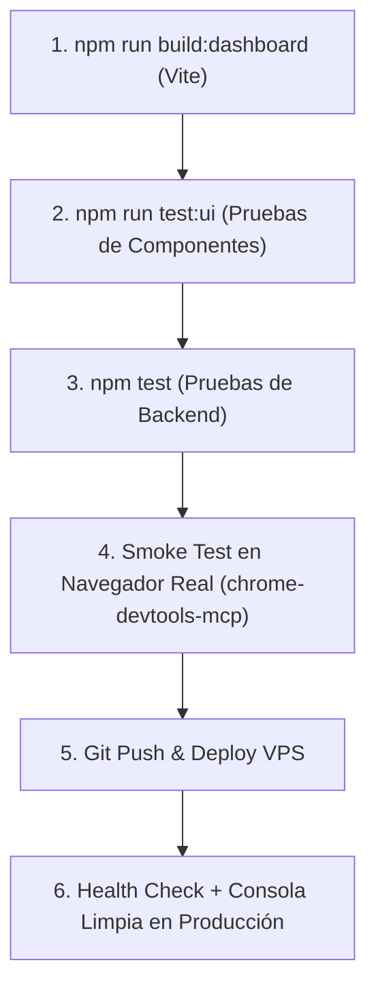

# Manual de Resiliencia Frontend y Suite de Pruebas: TitanBot Web Dashboard

> **Objetivo:** Establecer una arquitectura de pruebas automatizadas en el frontend y un estándar de programación defensiva para APIs del navegador, garantizando que errores de tiempo de ejecución (*runtime crashes*) nunca lleguen a producción.

---

## 1. Análisis Post-Mortem: El Incidente `Invalid option : timeStyle`

### A. Anatomía del Error
En la versión inicial de la pestaña de copias y respaldos ([`SnapshotsTab.jsx`](file:///c:/Users/Laptop-150/jorge/TitanBot/dashboard/src/pages/manage/SnapshotsTab.jsx)), se introdujo la siguiente línea de renderizado para la tarjeta KPI de último respaldo:

```javascript
// ❌ CÓDIGO DEFECTUOSO
const lastDateFormatted = latestSnapshot?.createdAt
  ? new Date(latestSnapshot.createdAt).toLocaleDateString(undefined, {
      dateStyle: 'medium',
      timeStyle: 'short', // 💥 EXCEPCIÓN EN RUNTIME
    })
  : 'Ninguno';
```

### B. ¿Por qué estalló en el Navegador?
Según la especificación ECMAScript de `Intl.DateTimeFormat`:
- `Date.prototype.toLocaleDateString([locales, [options]])` solo admite opciones relacionadas con **fechas** (`dateStyle`, `year`, `month`, `day`, `weekday`).
- La inclusión de `timeStyle` dentro de `toLocaleDateString` arroja inmediatamente un `RangeError: Invalid option : timeStyle` en el motor V8 de Chromium.
- Para formatear tanto fecha como hora en una sola llamada, el estándar exige el uso de `Date.prototype.toLocaleString()`.

### C. La Falsa Sensación de Seguridad: Brechas del Pipeline Anterior

| Etapa del Pipeline | Resultado | Por qué NO detectó el error |
| :--- | :--- | :--- |
| **Backend Unit Tests** (`npm test`) | **✓ 221 pasadas / 0 fallidas** | Los tests unitarios evalúan exclusivamente Node.js (PostgreSQL, Zod, Discord Gateway y Express). **Ningún test de backend monta componentes de React.** |
| **Vite Production Build** (`npm run build`) | **✓ 1642 módulos empaquetados** | Rollup y Vite hacen análisis estático de dependencias y transpilación JSX. Como la sintaxis JS es válida (un objeto pasado a un método existente), el empaquetador no puede predecir qué opciones valida `Intl` internamente en el navegador. |
| **TypeScript / Type-checking** | *No configurado en `.jsx`* | Al ser código JavaScript estándar sin tipos estrictos en React, el compilador no alertó sobre las opciones de tipo de `DateTimeFormatOptions`. |

**Conclusión:** Existía una desconexión total entre el éxito del backend y la verificación del renderizado real en el navegador.

---

## 2. Arquitectura de la Suite de Pruebas Frontend

Para cerrar esta brecha, el frontend del dashboard (`dashboard/`) requiere su propia suite de pruebas automatizadas basada en **Vitest** y **React Testing Library**.

```
dashboard/
├── src/
│   ├── utils/
│   │   └── formatters.js          # Módulo centralizado y blindado de formateo
│   ├── pages/
│   │   └── manage/
│   │       ├── SnapshotsTab.jsx
│   │       └── ...
│   └── tests/
│       ├── setup.js               # Configuración global del DOM simulado y mocks
│       ├── unit/
│       │   └── formatters.test.js # Pruebas unitarias de formateo con casos límite
│       └── smoke/
│           ├── SnapshotsTab.test.jsx
│           ├── TicketsTab.test.jsx
│           ├── EconomyTab.test.jsx
│           └── LoggingTab.test.jsx
├── vitest.config.js               # Configuración de Vitest con jsdom
└── package.json
```

### A. Dependencias de Pruebas a Incorporar

```json
{
  "devDependencies": {
    "vitest": "^2.1.0",
    "@testing-library/react": "^16.0.0",
    "@testing-library/user-event": "^14.5.0",
    "@testing-library/jest-dom": "^6.5.0",
    "jsdom": "^25.0.0"
  },
  "scripts": {
    "test:ui": "vitest run",
    "test:ui:watch": "vitest",
    "test:ui:coverage": "vitest run --coverage"
  }
}
```

### B. Configuración Global de Pruebas (`dashboard/src/tests/setup.js`)
Proporciona un entorno DOM controlado con mocks para las APIs que no existen de forma nativa en Node.js:

```javascript
import '@testing-library/jest-dom';
import { vi } from 'vitest';

// Mock de i18next para evitar fallos de traducción en tests
vi.mock('react-i18next', () => ({
  useTranslation: () => ({
    t: (key) => key,
    i18n: { language: 'es' },
  }),
}));

// Mock de react-router-dom para proveer params
vi.mock('react-router-dom', async () => {
  const actual = await vi.importActual('react-router-dom');
  return {
    ...actual,
    useParams: () => ({ guildId: '123456789012345678' }),
  };
});

// Mock del contexto del servidor Discord
vi.mock('../contexts/GuildContext', () => ({
  useGuild: () => ({
    currentGuild: {
      id: '123456789012345678',
      name: 'Servidor de Prueba',
      icon: null,
    },
  }),
}));
```

### C. Ejemplo de Prueba de Humo y Renderizado Real (`SnapshotsTab.test.jsx`)
Esta prueba monta el componente con datos idénticos a los de producción y **habría atrapado de inmediato el error de `timeStyle`**:

```javascript
import { render, screen, waitFor } from '@testing-library/react';
import { describe, it, expect, vi, beforeEach } from 'vitest';
import { SnapshotsTab } from '../../pages/manage/SnapshotsTab';
import * as api from '../../api/client';

describe('SnapshotsTab - Verificación de Render y Resiliencia', () => {
  beforeEach(() => {
    vi.restoreAllMocks();
  });

  it('renderiza sin fallar cuando hay una instantánea con fechas y métricas pobladas', async () => {
    // Simulamos respuesta real del backend
    vi.spyOn(api, 'apiFetch').mockResolvedValue({
      success: true,
      snapshots: [
        {
          id: '51b16c1e-5846-468e-8363-3e2290aef61d',
          name: 'Backup Inicial - 8/9/2026',
          createdAt: '2026-09-09T01:15:17.612Z',
          createdBy: { id: '537781911192600576', tag: 'yorchgs' },
          counts: { roles: 2, categories: 2, channels: 3 },
        },
      ],
    });

    // Si Date o Intl arrojan RangeError o TypeError en tiempo de render, render() fallará aquí:
    render(<SnapshotsTab />);

    // Verifica que se supere el estado de carga
    await waitFor(() => {
      expect(screen.getByText('Backup Inicial - 8/9/2026')).toBeInTheDocument();
    });

    // Verifica que los contadores no muestren 0
    expect(screen.getByText(/2 roles/i)).toBeInTheDocument();
    expect(screen.getByText(/2 categorías/i)).toBeInTheDocument();
    expect(screen.getByText(/3 canales/i)).toBeInTheDocument();
    expect(screen.getByText(/yorchgs/i)).toBeInTheDocument();
  });

  it('maneja de forma segura fechas corruptas o null sin romper la página', async () => {
    vi.spyOn(api, 'apiFetch').mockResolvedValue({
      success: true,
      snapshots: [
        {
          id: 'corrupt-date-test',
          name: 'Backup Fecha Corrupta',
          createdAt: 'invalid-iso-string',
          createdBy: null,
          counts: { roles: 0, categories: 0, channels: 0 },
        },
      ],
    });

    expect(() => render(<SnapshotsTab />)).not.toThrow();
  });
});
```

---

## 3. Guía de Programación Defensiva para APIs del Navegador

El navegador es un entorno inherentemente hostil: diferentes navegadores implementan APIs web con variaciones sutiles, los usuarios utilizan modos incógnito, extensiones de bloqueo y conexiones inestables. Todo acceso a APIs web debe ser **defensivo**.

### A. Módulo Centralizado de Formateo Seguro (`formatters.js`)
> **Regla de oro:** Nunca ejecutar `new Date().toLocaleDateString(...)` o `Intl` directamente en el cuerpo de un componente JSX.

Crear y utilizar el módulo `dashboard/src/utils/formatters.js`:

```javascript
/**
 * Formatea una fecha y hora de forma 100% segura contra excepciones de Intl.
 * @param {string|number|Date} dateInput
 * @param {string} fallback
 * @param {Intl.DateTimeFormatOptions} options
 */
export function safeFormatDateTime(
  dateInput,
  fallback = 'N/A',
  options = { dateStyle: 'medium', timeStyle: 'short' }
) {
  if (!dateInput) return fallback;
  try {
    const d = dateInput instanceof Date ? dateInput : new Date(dateInput);
    if (isNaN(d.getTime())) return fallback;

    // Se usa toLocaleString, NUNCA toLocaleDateString con timeStyle
    return d.toLocaleString(undefined, options);
  } catch {
    try {
      // Fallback básico sin opciones personalizadas si el motor no soporta dateStyle/timeStyle
      return new Date(dateInput).toLocaleString();
    } catch {
      return fallback;
    }
  }
}

/**
 * Formatea solo la fecha (día, mes, año).
 */
export function safeFormatDate(dateInput, fallback = 'N/A') {
  if (!dateInput) return fallback;
  try {
    const d = dateInput instanceof Date ? dateInput : new Date(dateInput);
    if (isNaN(d.getTime())) return fallback;
    return d.toLocaleDateString(undefined, { dateStyle: 'medium' });
  } catch {
    return fallback;
  }
}

/**
 * Formatea números grandes con separadores de miles de forma segura.
 */
export function safeFormatNumber(num, fallback = '0') {
  if (num === null || num === undefined) return fallback;
  const parsed = Number(num);
  if (isNaN(parsed)) return fallback;
  try {
    return parsed.toLocaleString();
  } catch {
    return String(parsed);
  }
}
```

### B. Manejo Defensivo de Almacenamiento Local (`localStorage` / `sessionStorage`)
En modo incógnito o en iframes, `window.localStorage` puede arrojar `DOMException: QuotaExceededError` o `SecurityError: The operation is insecure`.

```javascript
export const safeStorage = {
  get: (key, defaultValue = null) => {
    try {
      if (typeof window === 'undefined' || !window.localStorage) return defaultValue;
      const val = window.localStorage.getItem(key);
      return val !== null ? JSON.parse(val) : defaultValue;
    } catch {
      return defaultValue;
    }
  },
  set: (key, value) => {
    try {
      if (typeof window === 'undefined' || !window.localStorage) return false;
      window.localStorage.setItem(key, JSON.stringify(value));
      return true;
    } catch {
      return false;
    }
  },
  remove: (key) => {
    try {
      if (typeof window === 'undefined' || !window.localStorage) return;
      window.localStorage.removeItem(key);
    } catch {}
  },
};
```

### C. Manejo Defensivo del Portapapeles (`navigator.clipboard`)
`navigator.clipboard.writeText` falla si:
- El sitio se carga por HTTP en lugar de HTTPS.
- El usuario deniega permisos o cambia de pestaña antes de completar la promesa.

```javascript
export async function safeCopyToClipboard(text) {
  if (!text) return false;
  try {
    if (navigator?.clipboard?.writeText) {
      await navigator.clipboard.writeText(text);
      return true;
    }
  } catch {}

  // Fallback tradicional usando elemento textarea temporal
  try {
    const textarea = document.createElement('textarea');
    textarea.value = text;
    textarea.style.position = 'fixed';
    textarea.style.opacity = '0';
    document.body.appendChild(textarea);
    textarea.select();
    const successful = document.execCommand('copy');
    document.body.removeChild(textarea);
    return successful;
  } catch {
    return false;
  }
}
```

### D. Error Boundaries Granulares (Aislamiento de Widgets)
Actualmente, un error en una tarjeta arroja el error al `RootErrorBoundary`, destruyendo toda la aplicación y mostrando la pantalla *"Algo salió mal"*.

**Mejora:** Implementar `WidgetErrorBoundary` para encapsular tarjetas individuales y secciones no críticas:

```jsx
<WidgetErrorBoundary fallback={<CardErrorFallback title="No se pudo cargar la métrica" />}>
  <SnapshotKpiCards snapshots={snapshots} />
</WidgetErrorBoundary>
```
Si una tarjeta falla, solo esa tarjeta muestra un aviso de error mínimo con botón de recarga, **manteniendo el resto de la página y las acciones operativas**.

---

## 4. Protocolo Obligatorio de Verificación Pre-Despliegue

A partir de este incidente, ningún cambio de frontend puede declararse listo ni empujarse a producción sin cumplir rigurosamente este checklist en 5 pasos:



1. **Compilación Estática:** `npm run build` en `dashboard` (código de salida 0).
2. **Pruebas de Componentes Frontend:** `npm run test:ui` (renderizado de páginas con datos y validación de Error Boundaries).
3. **Pruebas de Backend:** `npm test` en la raíz (221 tests passing).
4. **Verificación en Navegador Real:**
   - Navegar a la vista modificada en el navegador local o con herramientas MCP de navegación (`chrome-devtools-mcp`).
   - Confirmar que la consola del navegador reporte **0 errores de JavaScript**.
5. **Verificación Post-Despliegue en VPS:**
   - Inspeccionar el endpoint `/health` del contenedor (`docker logs titanbot`).
   - Refresco forzado en producción para confirmar renderizado visual intacto.
